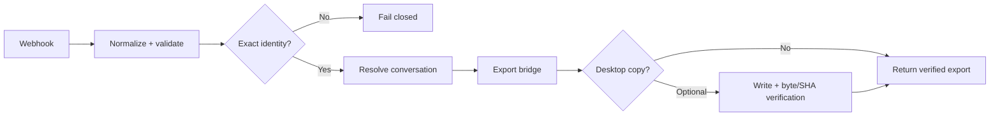
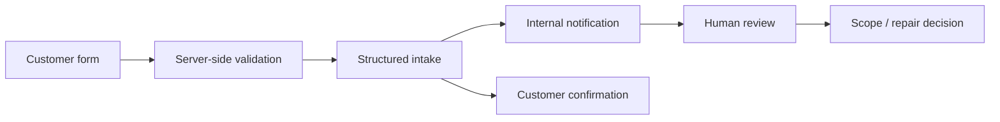
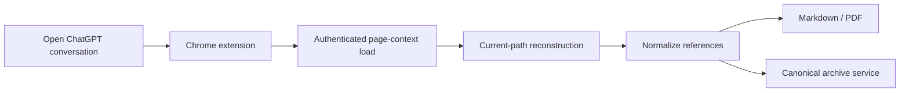

# Automation & AI Systems

**Donald (Chip) Wilson** — AI automation & systems implementation

I build workflows, integrations, browser tooling, and AI-assisted systems where **correct routing, evidence, and verification matter**.

`n8n` · `REST APIs` · `Webhooks` · `Cloudflare Workers / D1 / R2` · `TypeScript` · `Google Ads API / GAQL` · `Chrome extensions` · `GitHub`

## Selected systems

| System | Concrete result | Proof |
| --- | --- | --- |
| **Paid Traffic Attribution & Revenue Intelligence** | First-touch attribution preserved; repeat paid clicks tracked per session; current Ads state separated from immutable evidence history | [Implementation evidence](./proof/traffic-attribution-system.md) |
| **Verified Conversation Export Workflow** | Real run exported **384 turns / 268,184 bytes**, with exact-title resolution and full branch-root confirmation | [Sanitized run JSON](./proof/conversation-export-run.json) |
| **Customer Intake & Human Review Pipeline** | Server-side intake, internal notification, customer confirmation, and a deliberate human scope/pricing boundary | [Implementation evidence](./proof/customer-intake-system.md) · [Live system](https://unjankai.com/) |
| **Browser Conversation Archiver** | Reconstructs the current conversation path, exports Markdown/PDF, and can send a canonical archive through a narrow service | [Implementation evidence](./proof/browser-archive-system.md) |

---

## 1. Paid Traffic Attribution & Revenue Intelligence

**Problem:** Paid-click, website-session, and reporting data lived at different layers, making it easy to lose attribution history or confuse current state with historical evidence.

- Immutable first-touch Google Ads / UTM attribution at visitor level.
- Repeat paid-click attribution stored separately at session level.
- Read-only Google Ads REST / GAQL bridge; no mutate operations.
- Change-aware snapshots plus separate report and historical evidence archives.

**Stack:** `Cloudflare Workers` · `D1` · `R2` · `TypeScript` · `Google Ads API` · `GAQL`

**Proof:** [Sanitized implementation evidence →](./proof/traffic-attribution-system.md)

---

## 2. Verified Conversation Export Workflow

**Problem:** A workflow can be green while still exporting the wrong record, the wrong branch, or an unverifiable file.

- 10-node n8n workflow with exact-title / exact-ID resolution and ambiguity rejection.
- Uses authenticated API calls, conditional routing, and bounded retry.
- Distinguishes workflow completion from verified task completion.
- Optional local delivery verifies byte count and SHA-256 before success.

**Stack:** `n8n` · `Webhooks` · `REST APIs` · `JSON` · `SSH` · `SHA-256`

**Real execution:** **384 turns**, **268,184 bytes**, exact-title lookup, full branch-root confirmed.

**Proof:** [Sanitized runtime evidence →](./proof/conversation-export-run.json)

---

## 3. Customer Intake & Human Review Pipeline

**Problem:** People with a broken automation often cannot diagnose the cause; intake should capture the problem without letting automation make binding business decisions.

- Accepts browser form or JSON submissions through a server-side endpoint.
- Sanitizes input and validates required contact data.
- Sends internal notification and customer confirmation in parallel.
- Fails the request if either required email delivery fails.
- Keeps diagnosis, scope, and pricing under human review.

**Stack:** `Astro` · `TypeScript / JavaScript` · `Cloudflare Pages Functions` · `Resend` · `HTML forms`

**Proof:** [Implementation evidence →](./proof/customer-intake-system.md) · [Inspect the live intake surface →](https://unjankai.com/)

---

## 4. Browser Conversation Archiver

**Problem:** Exporting a long AI conversation should preserve the **current path a human is actually viewing**, not abandoned sibling branches or partial DOM text.

- Manifest V3 extension with only `activeTab`, `scripting`, and `downloads` permissions plus the archive-service host.
- Loads conversation data from the authenticated page context and reconstructs the current path.
- Produces Markdown and PDF from normalized conversation data.
- Sends archive payloads only on explicit export action through a narrow authenticated Worker.

**Stack:** `Chrome MV3` · `JavaScript` · `ChatGPT page context` · `Markdown/PDF` · `Cloudflare Worker` · `GitHub archive`

**Proof:** [Sanitized implementation evidence →](./proof/browser-archive-system.md)

---

## Additional work

| System | What it does | Technical substance |
| --- | --- | --- |
| **Controlled AI Task Runner With Approval & Verification** | Creates/resumes one exact AI implementation task from an immutable handoff; handles sandbox, approval, result capture, and post-run verification | Node.js, CLI orchestration, immutable manifests, app-server integration, approval modes |
| **Exact-ID ChatGPT Project & Conversation CLI** | Creates, opens, renames, deletes, exports, archives, and reconciles project/conversation state without guessing ambiguous names | Node.js, authenticated desktop integration, exact IDs, guarded mutation, GitHub archive |

*Evidence-gated research/process mining work exists, but it is intentionally not featured here because the systems above are stronger proof of implementation capability.*

---

## Capability map

| I can help with | Typical work |
| --- | --- |
| **Build** | n8n workflows, webhooks, API automations, browser tools, internal utilities |
| **Integrate** | REST/JSON services, Cloudflare, GitHub, Google Ads data, browser/application contexts |
| **Diagnose** | auth, routing, data-flow, attribution, stale-source, false-success, workflow drift |
| **Operate safely** | exact identity, readback, checksums, evidence history, bounded failure handling |
| **Hand off** | concise architecture, acceptance criteria, verification evidence, operating notes |

> **AI implementation model:** AI is used heavily for implementation; Chip owns requirements, architecture, testing, verification, acceptance, and handoff.

---

## Contact

[LinkedIn](https://www.linkedin.com/in/donzpixelz/) · [GitHub](https://github.com/donzpixelz) · [Unjank AI](https://unjankai.com/)
