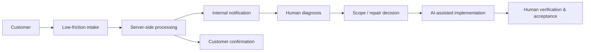
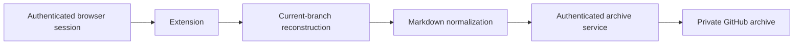
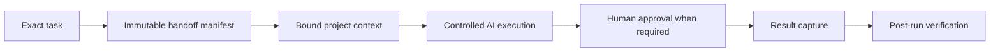

# Automation & AI Systems Portfolio

**Donald (Chip) Wilson**  
AI Automation & Systems Consultant

I build, repair, integrate, and operate systems where workflows, APIs, browser tooling, infrastructure, business data, and AI-assisted implementation meet.

My operating model is:

```text
Problem → Requirements → System design → Supervised AI-assisted implementation → Testing → Verification → Handoff
```

I use AI heavily for implementation, research, debugging, workflow construction, and documentation. I remain responsible for the requirements, business rules, architectural direction, identifying bad assumptions and drift, testing, verification, acceptance, and handoff.

This portfolio focuses on real systems and operating patterns rather than internal project names.

---

## Featured Systems

### 1. Paid Traffic Attribution & Revenue Intelligence

**Business problem**

Paid acquisition data is easy to misread when website sessions, ad clicks, reporting snapshots, and historical evidence live in different systems. The useful question is not merely "did someone click an ad?" but whether the traffic, session, attribution, and advertising evidence can be tied together without silently rewriting history.

**System shape**


**What the system does**

- captures first-party page and session activity;
- preserves immutable first-touch Google Ads / UTM attribution;
- records repeat paid clicks at the session level without overwriting original attribution;
- queries current Google Ads state through read-only REST / GAQL access;
- creates change-aware snapshots so routine checks do not masquerade as new historical events;
- separates current operational state, report packages, and historical evidence;
- uses bounded retention, privacy controls, checksums, and readback verification around preserved evidence.

**Tools**

`Cloudflare Workers` · `D1` · `R2` · `TypeScript` · `Google Ads API` · `GAQL` · `REST APIs`

**My role**

I defined what attribution needed to mean operationally, separated current truth from historical evidence, set the privacy and retention boundaries, directed implementation, challenged false-success conditions, and verified the resulting behavior against the business questions the system was meant to answer.

**What this demonstrates**

I can connect marketing, traffic, API, storage, and reporting systems while preserving enough provenance to trust the result.

---

### 2. Verified Workflow & API Automation

**Business problem**

A workflow can complete successfully while the human task still fails. If the wrong record was selected, the wrong file was delivered, or the output cannot be proven, a green workflow status is not enough.

**System shape**


**What the system does**

- accepts a bounded webhook request;
- validates project / conversation identity before execution;
- resolves exact records and rejects zero-match, conflicting, or ambiguous requests instead of guessing;
- routes the request through authenticated APIs and conditional logic;
- exports the requested artifact;
- optionally writes a local copy;
- verifies delivered bytes and SHA-256 before reporting success;
- keeps workflow completion distinct from verified task completion.

**Tools**

`n8n` · `Webhooks` · `HTTP / REST APIs` · `Authentication` · `JSON` · `Conditional routing` · `SSH` · `SHA-256`

**Verified evidence**

One validation run exported a **384-turn conversation** while confirming the requested conversation identity and branch/root relationship before returning success.

**My role**

I defined the identity and ambiguity rules, the success criteria, the human objective the workflow had to prove, and the verification boundary. AI-assisted implementation was supervised against those rules rather than accepted because the workflow merely executed.

**What this demonstrates**

I can build and repair n8n / API workflows where exact routing, failure handling, and verification matter as much as the happy path.

---

### 3. Customer Intake With Human-Controlled AI

**Business problem**

A customer with a broken AI system or automation often cannot name the root cause. Requiring them to diagnose the technical problem before asking for help creates unnecessary friction, while allowing AI to make binding scope or pricing decisions creates a different kind of risk.

**System shape**



**What the system does**

- starts with simple contact information instead of demanding a technical diagnosis;
- lets the customer add problem details, desired outcome, evidence, and context when useful;
- processes submissions server-side;
- sends internal notification and customer confirmation;
- keeps diagnosis, scope, pricing, and consequential decisions under human control;
- uses AI as implementation and diagnostic leverage rather than as final authority.

**Tools**

`Astro` · `TypeScript` · `Cloudflare Pages / Functions` · `HTML forms` · `Resend` · `AI-assisted workflows`

**My role**

I defined the customer path, decided which information should be required versus optional, set the human decision boundary, supervised implementation, and verified that the system reduced intake friction without pretending automation could replace judgment.

**What this demonstrates**

I can build customer-facing operational workflows that automate repetitive transport and processing while deliberately preserving human control where it matters.

---

## More Systems & Automation Work

### Browser-to-Private-Archive Automation

**Problem:** Preserve the exact ChatGPT conversation branch a person is viewing without mixing abandoned sibling branches or extracting reusable session credentials.

**System shape**



**Capabilities demonstrated**

- Chrome extension development;
- authenticated page-context requests;
- active/current-branch reconstruction from conversation data;
- Markdown and citation normalization;
- browser download plus private GitHub archival;
- minimal browser permissions;
- privacy boundaries that keep reusable ChatGPT credentials out of the extension;
- exact logical-record upsert behavior for repeat exports.

**Outcome**

A human can preserve the conversation branch they are actually looking at instead of exporting unrelated sibling history or manually assembling transcripts.

---

### Controlled AI Implementation Orchestration

**Problem:** AI-assisted implementation becomes unreliable when task identity, permissions, model settings, approvals, result capture, and verification are implicit.

**System shape**



**Capabilities demonstrated**

- immutable task / handoff identity;
- resumable AI implementation sessions;
- explicit model, effort, sandbox, and approval controls;
- project-context binding;
- human approval paths;
- failure-state handling;
- result-stream capture;
- verification that the completed session and requested result actually match.

**Outcome**

AI becomes an implementation engine inside an auditable process instead of an unbounded actor whose output is accepted on faith.

---

### ChatGPT Project & Conversation Operations

**Problem:** Repetitive project and conversation operations become risky when human-readable names are treated as authoritative identity and destructive actions can proceed on ambiguous targets.

**Capabilities demonstrated**

- local CLI design for project / conversation lifecycle operations;
- exact immutable-ID handling;
- create, rename, delete, open, show, export, and archive flows;
- ambiguity rejection rather than name-based guessing;
- authenticated integration through the already-running application context;
- managed project installation / uninstall lifecycle;
- exact readback after mutation;
- canonical conversation archival;
- guarded destructive operations.

**Outcome**

Routine application-management work becomes repeatable and scriptable without relaxing identity and verification rules.

---

### Evidence-Gated Process Analysis

**Problem:** "This looks manual" is not enough evidence that a business process is broken or worth automating.

**System shape**


**Capabilities demonstrated**

- n8n research workflow design;
- current-web evidence collection;
- structured evidence for and against a hypothesis;
- AI-assisted classification;
- deterministic rules that can override an overly optimistic model result;
- durable dedupe / history;
- bounded output for human review;
- explicit separation between possible friction and commercially supportable confirmed friction.

**Outcome**

Automation recommendations are based on visible evidence of a real problem rather than the assumption that every manual process should be automated.

---

## What I Can Build, Integrate, Diagnose, or Operate

| Area | Examples of work |
| --- | --- |
| **n8n & workflow automation** | Webhooks, routing, API calls, transformations, validation, failure handling, readback, lifecycle verification |
| **REST APIs & integrations** | Authentication, JSON/HTTP workflows, exact-record resolution, external-service integration, bounded data movement |
| **AI-assisted operational systems** | Human-in-the-loop workflows, supervised implementation, evidence-gated decisions, approval boundaries |
| **Cloudflare systems** | Workers, Pages, Functions, D1, R2, access boundaries, operational APIs |
| **Marketing / advertising data** | Google Ads API, GAQL, attribution, snapshots, reporting evidence |
| **Browser tooling** | Chrome extensions, authenticated page-context integration, extraction, normalization, download/archive workflows |
| **GitHub-backed operations** | Archive workflows, exact-record updates, immutable handoffs, evidence capture |
| **Reliability & verification** | Ambiguity rejection, checksums, byte verification, readback, false-success detection, acceptance criteria |
| **Technical rescue / diagnosis** | Follow the evidence across workflow logic, APIs, authentication, routing, data, runtime, and user-facing behavior |
| **Documentation & handoff** | Operating rules, architecture summaries, acceptance criteria, provenance, bounded next-owner handoff |

---

## How I Work With AI

I do **not** claim to manually type every workflow node or line of code.

I use AI heavily because it increases implementation speed and lets me work across a broader technical surface. The important boundary is ownership.

**I own:**

- the problem definition;
- requirements and business rules;
- architectural direction;
- constraints and safety boundaries;
- identifying bad assumptions, drift, and false-success states;
- testing strategy;
- verification;
- acceptance;
- documentation and handoff.

**AI assists with:**

- implementation;
- workflow construction;
- code generation;
- research;
- debugging;
- refactoring;
- test generation;
- documentation production.

The finished system is accepted because it meets the defined objective and survives verification—not because an AI said it was done.

---

## Working With Me

The best fit is usually a real operational problem with an existing system, workflow, integration, or implementation that needs to be built, repaired, connected, simplified, verified, or handed off cleanly.

I can work as bounded implementation capacity for another consultant or firm, or directly on a clearly scoped system problem.

[LinkedIn](https://www.linkedin.com/in/donzpixelz/) · [GitHub Profile](https://github.com/donzpixelz) · [Unjank AI](https://unjankai.com/)
