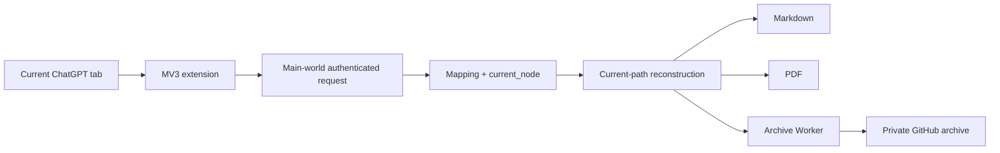

# Browser Conversation Archiver — implementation evidence

**Evidence type:** sanitized implementation evidence verified from the current ThreadScribe source on 2026-09-30.

No ChatGPT account IDs, conversation IDs, archive credentials, private Worker URLs, or archived conversation content are included.

## Current extension boundary

Current Manifest V3 permissions:

```json
{
  "permissions": ["activeTab", "scripting", "downloads"],
  "host_permissions": ["archive-service host only"]
}
```

## Verified implementation behavior

- Runs the full-load request inside the ChatGPT page's main world.
- Uses the authenticated page context to retrieve conversation data.
- Requires a conversation mapping plus `current_node` before treating a full load as valid.
- Reconstructs the current conversation path rather than flattening every sibling branch.
- Supports Markdown and PDF output.
- Keeps selected export data in memory during processing.
- Sends a canonical archive payload only when the user explicitly invokes archive export.
- Routes canonical archival through an authenticated Worker rather than embedding a broad GitHub credential in the extension.

## Architecture



## Source evidence

- Manifest blob: `3cfa1eecd826086cebdd2fef9d9c76397977407f`
- Background implementation blob: `6b8186d2af1de3a3d114e6dafa9ae2af7df444c4`
