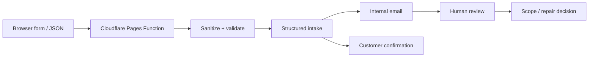

# Customer Intake & Human Review Pipeline — implementation evidence

**Evidence type:** current source implementation verified from the Unjank AI repository on 2026-09-30.

**Inspectable public surface:** https://unjankai.com/

## Server-side intake behavior

The current `functions/api/intake.js` implementation:

1. accepts form or JSON POST input;
2. sanitizes text and validates required name/email fields;
3. rejects requests when the email service is not configured;
4. builds one structured internal intake message;
5. sends the internal notification and customer confirmation concurrently through Resend;
6. treats failure of either required message as an intake failure;
7. records an optional measurement event only after successful intake;
8. returns JSON success for API callers or a browser redirect for native form submissions.

## Human-control boundary

Automation transports and structures the request. Diagnosis, evidence requests, binding scope, pricing, and repair decisions remain human-reviewed.

## Architecture

## Source evidence

- Current intake implementation blob: `fc616b68db01db51167965a6d3cf7ea863cde917`
- The public portfolio intentionally omits destination addresses, provider credentials, message IDs, and measurement identifiers.
