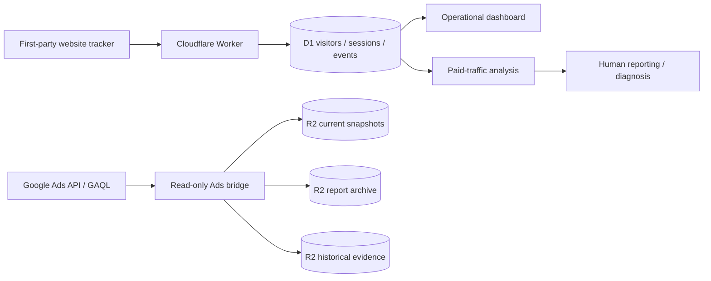

# Paid Traffic Attribution & Revenue Intelligence — implementation evidence

**Evidence type:** sanitized implementation contract verified from the current private source repositories on 2026-09-30.

No visitor records, account IDs, customer data, private URLs, credentials, or raw IP data are reproduced here.

## Verified system properties

| Layer | Verified behavior |
| --- | --- |
| Website tracking | First-party tracker creates persistent anonymous visitor identity and tab-scoped session identity. |
| First-touch attribution | Google Ads / UTM first-touch fields are insert-only; application logic does not rewrite them and the data layer rejects attempted mutation. |
| Repeat paid clicks | A returning visitor's new paid click is stored on the new session without replacing original visitor attribution. |
| Ads integration | Google Ads bridge uses read-only REST / GAQL queries; no Ads mutate operation is implemented. |
| Current-state history | Successful checks persist compact immutable check records; full snapshots are written only on first complete check or normalized state change. |
| Evidence storage | Current snapshots, report packages, and historical archives are kept in separate R2 evidence boundaries. |
| Integrity | Persisted historical/report artifacts carry byte counts and SHA-256 metadata; exact snapshot reads verify stored payload checksum. |
| Privacy / retention | Raw IP retention is bounded; sanitized backup policy excludes raw IPs and secrets. |

## Architecture

## What is intentionally not claimed

- No public ROI percentage is claimed.
- No customer-level or visitor-level dataset is published.
- No Google Ads write/mutation capability is claimed.
